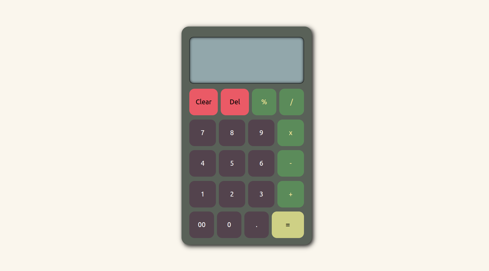

# calculator
**Calculator made with HTML, CSS, and JavaScript**
## Preview 

## Features
- Basic Math Operations (addition, subtraction, multiplication, division, and modulo)
- "." button allowing decimal numbers
- Delete button (backspace) : deletes the last number
- Clear button (letter C or c on the keyboard): clears the whole screen
- Keyboard support
- Current operator has a different color than the rest
- Text at the top that shows the first number and the current operator
## How to run 
Open : [Live preview](https://abdulwhab-elghareeb.github.io/calculator/)